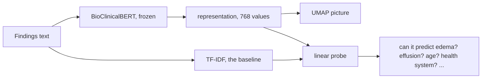

# Week 1: What does a report representation contain?

## The question

A language model turns a report into a representation, also called an embedding: a
vector of 768 values that stands for the whole text. Any model built on top of it, for
example an edema classifier, only sees this vector. It cannot use anything that is not
in it, and it can use anything that is.

This week we open the representation of the Findings text and ask:

1. **Is the clinical information in there?** Can edema and pleural effusion be read out?
2. **What else is in there?** Age, health system, X-ray machine, year, report length?

The second question is the Responsible AI part. Information about the hospital or the
patient group that sits in the representation is available to every model built on it.
This week we check what is present.

## What we ask you to do

**Must:** compute the representation (code provided), look at it with UMAP, measure with
linear probes whether edema and pleural effusion can be read out and compare with a
TF-IDF baseline, do the same for two other targets of your choice, interpret.

**Nice to have:** one deeper look, see the end of this page.




## Step 1: setup

`python scripts/check_setup.py` must end with `Setup looks good.`

## Step 2: compute the representation

```bash
python scripts/make_embeddings.py
```

This runs BioClinicalBERT over the Findings of all 10,000 studies. The model is
*frozen*: used as downloaded, never trained by us. It gives one vector per word; the
script averages them (*mean pooling*) into one vector per study and saves the result in
`data/embeddings/`. 

From here on, you write your own scripts. Two helper files exist:

- `src/data.py`: `study_table()` (one row per study with text, labels and metadata),
  `findings_texts()`, `usable_findings()`, `binary_label(studies, "edema")` (1, 0, or
  missing for uncertain and not mentioned), `top_k_classes()`.
- `src/embeddings.py`: `load_embeddings()`.

```python
from src.data import study_table, findings_texts, usable_findings, binary_label
from src.embeddings import embedding_path, load_embeddings

studies = study_table()
X = load_embeddings(embedding_path("findings"), studies)   # shape (10000, 768)
```


## Step 3: look at the representation

UMAP (`umap-learn`) maps the 768 values of each study to two, so all studies can be
drawn as points; studies that are close in the representation end up close in the
picture. PCA to 50 dimensions first makes it faster.

- `n_neighbors` decides how many neighbouring studies UMAP looks at when placing a
  point. Small values keep local detail and break the picture into islands; large
  values keep the global shape. Make the picture with the default (15) and with one
  small and one large value, for example 5 and 200.
- Colour the points by the edema and pleural effusion labels (clear cases only, the rest
  grey), then by metadata: health system, manufacturer, age, year, report length. Do
  the groups you see follow the diseases, or something else?


## Step 4: measure with linear probes

A linear probe is a logistic regression trained to predict one target from the
representation. If it predicts well, the information is present.

- Studies and labels: `binary_label` and `usable_findings`; drop missing labels.
- Model: logistic regression, features standardised.
- **Evaluation must be patient-wise.** 2,524 patients have more than one study; if a
  patient appears in both the training and the test part, the probe can recognise the
  patient instead of the disease. Use `StratifiedGroupKFold`, 5 folds, `patient_id` as
  groups; collect the test-fold probabilities and compute one AUROC on them.
- Sanity check: BioClinicalBERT for edema should give an AUROC of about 0.9.
- Baseline: repeat with TF-IDF (`TfidfVectorizer`), which describes a report only by
  the words and word pairs it contains. Fit the vectoriser on the training fold only,
  otherwise test words leak into the vocabulary; a `Pipeline` of vectoriser and
  logistic regression fitted inside each fold does this.

Result: AUROC for edema and pleural effusion.

## Step 5: what else is in there?

Choose 2 or 3 other targets and probe them the same way:

| Target | Column | Use as | Rule |
|--------|--------|--------|------|
| health system | `health_system` | 3 classes | recommended |
| scanner manufacturer | `manufacturer` | classes | keep the 6 most frequent, `top_k_classes` |
| modality | `modality` | CR vs DX | drop the rare others |
| age | `age_years` | number, or 65 and older | drop missing |
| study year | `study_year` | number | |
| report length | `findings_words` | number | |
| sex | `sex` | F vs M | drop `O` |
| hospital site | `institution` | classes | harder; keep the 10 most frequent |

Several classes: logistic regression and balanced accuracy. Numbers: ridge regression,
`GroupKFold`, R². Report every score with its chance level (0.5 for AUROC, 1 divided by
the number of classes for balanced accuracy, 0 for R²) and the number of studies.

## Step 6: interpret

What does the probe find that the UMAP picture does not show, or the other way round?
Where do TF-IDF and BioClinicalBERT differ, and why? What could the presence of hospital
information mean for a model built on this representation?

## Nice to have: one deeper look

- Are two targets entangled, for example manufacturer and site? Does a probe still work
  inside one health system?
- Where does the information sit? `make_embeddings.py --layer 6` or `--pooling cls`
  give other representations; probe every layer and plot the score per layer.
- Which words carry the information? Look at the TF-IDF probe weights.

